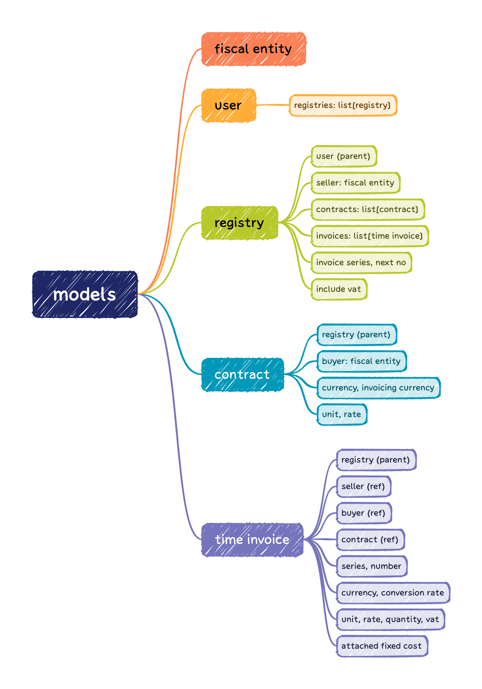

# micro-invoicer

Making invoices has never been easier

## Models hierarchy

## Use cases

Anonymous users
- can register via email (aka sign-up)

Registered users
- user can **CRUD** many registries, each registry identifies
  - a seller fiscal entity
  - a VAT rate

Under each registry
- Can can **CRUD** many service contracts, each contract identifies
  - a buyer fiscal entity
  - unit
  - unit price
  - currency
- Can view all invoices
- Can issue a new invoice, each invoice identifies:
  - seller (via registry)
  - buyer (via contract)
  - unit, unit price, currency, invocing currency (via contract)
  - conversion rate
  - quantity
  - additional fixed costs
- Can remove most recent invoice only

### ToDO use cases

Under each registry
- New invoices are issued in *draft* state
- Can publish a *draft* invoice (*published* invoices become read-only)
- Can only remove *draft* invoices
- Can *storno* a *published* invoice

## Setup instructions

1. `docker-compose build`
1. `docker-compose up`
1. `docker-compose down --remove-orphans`

_NB:_ Remember to backup your sqlite db every quarter.
